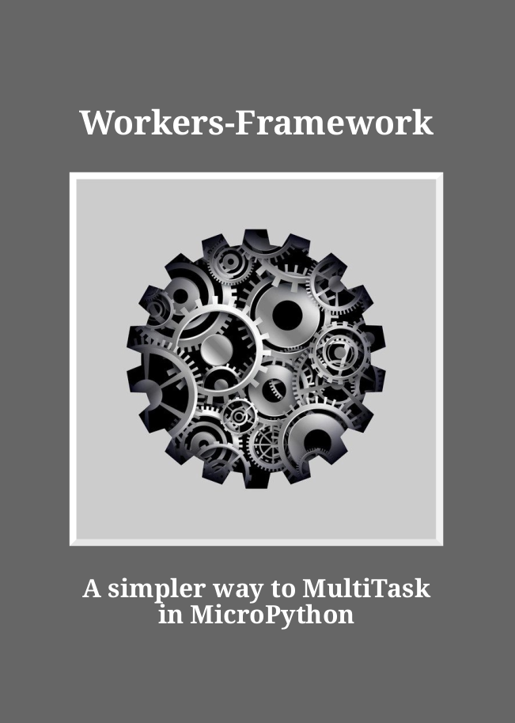

# workers-framework-micropython
Workers-Framework: A simpler way to MultiTask in MicroPython

The link [WF-Book-Sample.pdf](WF-Book-Sample.pdf) will take you to a free sample of the book, which includes the contents, introduction, and appendices.

The book PDF can be purchased at
[https://leanpub.com/Workers_Framework](https://leanpub.com/Workers_Framework)
if you are interested in purchasing the full version.

If you'd prefer to read this book as a flipbook online whenever and wherever you want, 
go to [https://shariltumin.gumroad.com/l/rbkkbn](https://shariltumin.gumroad.com/l/rbkkbn) and get one.

What's the big deal? You might be asking me. Let me give you a simple example of sequential versus concurrent execution.

``` python
# s_abcd.py - sequential script
def fun(n,m):
    for i in range(m):
       print(f'{n} at {i}')

fun('A',3)
fun('B',3)
fun('C',3)
fun('D',3)

```
and

``` python
# c_abcd.py - concurrent script
from worker import task, MT

@task
def fun(p):
    n,m = p
    c = yield
    for i in range(m):
       print(f'{n} at {i}')
       yield
    yield 'OK'

mt=MT(4)

mt.worker(fun, ('A',3)) # creat worker
mt.worker(fun, ('B',3))
mt.worker(fun, ('C',3))
mt.worker(fun, ('D',3))
mt.start()              # start all workers
print(mt.log())         # check for any error

```

The outputs of these two scripts shown side-by-side in the table below.

| s_abcd.py                       |  c_abcd.py                 |
|---------------------------------|----------------------------|
| A at 0                          | A at 0                     |
| A at 1                          | B at 0                     |
| A at 2                          | C at 0                     |
| B at 0                          | D at 0                     |
| B at 1                          | A at 1                     |
| B at 2                          | B at 1                     |
| C at 0                          | C at 1                     |
| C at 1                          | D at 1                     |
| C at 2                          | A at 2                     |
| D at 0                          | B at 2                     |
| D at 1                          | C at 2                     |
| D at 2                          | D at 2                     |


I hope you recognize the significance of these results.

Instead of four ```for``` loops, how about four ```while True``` loops? *Tasks* running as *workers* will solve the problem nicely.


Here's a simple example of using REPL keyboard input to control the rate at which the *Raspberry Pi Pico*'s onboard LED blinks.

``` python

# blink_rp2040.py
from worker import MT, task
import sys, uselect
from machine import Pin

# poll is better than uselect.select
spoll=uselect.poll()
spoll.register(sys.stdin,uselect.POLLIN)

@task
def kb(pm):
   c=yield
   poll=spoll.poll
   read=sys.stdin.read
   v=c.v
   v.D=500 # 0.5 sec delay at start
   while True:
      if poll(0):
         w=read(1)
         print('w:', w)
         if (w=='+' or w=='f') and v.D<1000: # faster rate
            v.D -= 10
         elif (w=='-' or w=='s') and v.D>10: # slower rate
            v.D += 10
         print('c.v.D:', v.D)
      yield

@task
def blink(pm):
   p=pm[0]
   led = Pin(p, Pin.OUT)
   c=yield
   v=c.v
   while True:
      led.toggle()
      if v.D>0: # if delay is 0 then the program hang
         wait=c.delay(v.D)
         while wait():yield

mt=MT(2)                # we need only 2 workers
mt.worker(kb, ())       # worker for keyboard (in)
mt.worker(blink, (25,)) # worker for LED (out)
mt.start()

```
